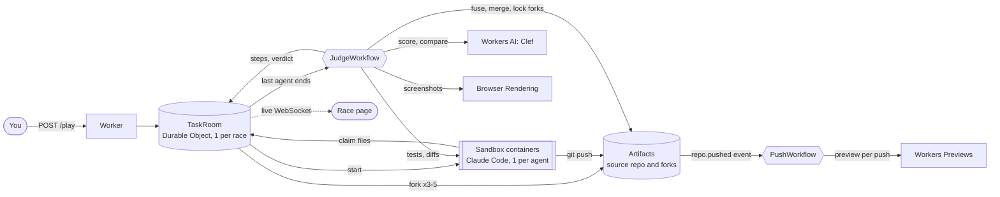

<p align="center">
  
</p>

# Thunderdome

Agents compete on each task. A judge picks the best change. The winner ships, and the "why" stays
with the commit.

You give one task. Thunderdome forks the repo once per agent, and 3 to 5 Claude Code agents
(Ponder, Zippy, Testy, Snip and Sparkle) race at once, each in its own container on its own fork.
They claim files before they edit, so clashes show up before they become merge conflicts, and
every push builds a live preview. When the last agent ends, a judge tests every fork, scores the
diffs with Workers AI, folds the losers' best work into the winner, merges it, and writes why it
won into the merge commit. There is no pull request: the race replaces it.

Built entirely on Cloudflare: Artifacts (git), Sandbox containers, Durable Objects, Workflows,
Workers Previews, Workers AI (Clef), Browser Rendering and static assets.

## Quickstart

No setup: the live deploy runs races for anyone.

1. Open **[thunderdome.wonbyte.dev/play](https://thunderdome.wonbyte.dev/play)**.
2. Pick a demo app (`trap`, `ui`, `clash` or `fusion`), edit the task if you like, and start.
3. Watch five robots race. In 2 to 4 minutes the judge picks a winner, merges it and says why.
   Click a robot to see its code, or open **replay** to watch it again.
4. Every race is in the **[gallery](https://thunderdome.wonbyte.dev/races)**, with a
   leaderboard and the judge's reason for each winner.

## How it works



1. **Fork.** The race forks the source repo once per agent, each fork with its own write token.
   Tokens never enter a sandbox: the outbound proxy adds them.
2. **Race.** Each agent runs Claude Code in its own container with its own style (careful, fast,
   test-first, lean, tidy) and writes its tests in a file of its own. It claims files on the
   TaskRoom's claim board before editing; a file someone else holds becomes a clash. Agents also
   hear what earlier races on the same app taught: who won and why.
3. **Previews.** Every push fires an Artifacts event into a Workflow that records it for the git
   graph and builds a Workers Preview of that commit.
4. **Judge.** A Workflow judges every fork in its own sandbox, in parallel (see [The judge](#the-judge)).
5. **Fusion.** The losers' files and hunks are tried on top of the winner. One is kept only when
   every test passes and Clef says it makes the change better, and the fusion ships only when the
   fused code scores at least the winner alone. Each kept part is a commit by the robot that wrote it.
6. **Ship.** The winner is merged into the source repo with the why as the merge commit body, and
   every fork is locked as a record. If the source moved on, three resolvers race to fix the
   conflict, and the first one whose tests all pass is merged.

The race page shows all of it live: the robots act out each real step, the result and previews
follow, with the race's Cloudflare bill. The X-ray button swaps the robots for the architecture,
lit by the same events, and tabs under the stage open the timeline, the git graph, the claim board and more.

## The judge

| Part | Points | How |
|---|---|---|
| Tests | 50 | A shared suite: the repo's tests from the base commit, plus each robot's new test files that pass in full on at least two forks |
| Task fit | 25 | Clef: does the diff do what the task asks of this robot (6 levels) |
| Clarity | 15 | Clef: readability (4 levels) and a yes/no on edits the task does not need |
| Claims | 10 | 2 off for a clash that another fork that passed tests avoided |

When the task asks for a visible change, Clef also scores screenshots of each preview, and the
split is tests 45, task fit 20, clarity 10, look 15, claims 10.

- **Fair tests.** No robot is graded only on tests it wrote itself. When the task gives robots
  different parts, Clef spots it and only the repo's tests count.
- **Clef sees whole functions.** It gets each changed function in full (`git diff --function-context`)
  and is asked twice, with the diff's files in both orders, averaged. One call moves by up to 3 points
  on a harmless rewrite of the diff; the average moves by at most 0.54 (measured on 38 forks).
- **Ties are honest.** Forks equal on tests and claims and within 0.75 points on Clef's ratings
  tie. Clef then reads the tied diffs side by side and picks one; if that is too close, the
  smaller diff wins, then the earlier finish. The why says which.
- **Agent output is data.** Diffs and test files go only in a Clef request's state, never in its
  questions.

## Run it yourself

You need a Cloudflare account on **Workers Paid** with Artifacts on, an Anthropic API key with
credits, Node.js 22.18+, and Docker or Podman (wrangler builds the sandbox image).

```sh
npm install
npm run check                                     # build, typecheck, lint, unit tests
npx wrangler login
npx wrangler secret put ADMIN_TOKEN               # any long random string; guards the admin routes
npx wrangler secret put ANTHROPIC_API_KEY         # the agents' key; never enters a sandbox
npx wrangler secret put CLOUDFLARE_PREVIEW_TOKEN  # API token with Workers Scripts: Edit, for previews
```

Set `CF_ACCOUNT_ID` in `wrangler.jsonc` to your account id (`npx wrangler whoami`), then deploy
and make the Worker that previews live under (once):

```sh
npm run deploy
npx wrangler deploy -c scripts/preview-worker.jsonc
```

With Podman, see [Using Podman](docs/reference.md#using-podman-instead-of-docker). Optional vars,
set with `npm run deploy -- --var NAME:value`: `AGENT_MODEL` (default `claude-haiku-5-5`),
`PLAY_INVITE` (an invite code for `/play`) and `PLAY_DAILY_LIMIT` (default 10).

Seed the demo apps once, then start a race:

```sh
export THUNDERDOME=https://thunderdome.<your-subdomain>.workers.dev ADMIN_TOKEN=<your token>
for app in trap ui clash fusion; do
  curl -X POST $THUNDERDOME/spike/seed -H "authorization: Bearer $ADMIN_TOKEN" \
    -H "content-type: application/json" -d "{\"repo\":\"thunderdome-$app\",\"app\":\"$app\"}"
done
```

Open `$THUNDERDOME/play`, or run a demo race from the terminal and follow it to the verdict:

```sh
THUNDERDOME_URL=$THUNDERDOME node scripts/race.mjs trap   # or ui, clash, clash-full, fusion; AGENTS=5; HOTFIX=1 adds a mid-race push (fusion)
```

Agents get at most 8 minutes and usually finish in 1 to 2; judging takes about a minute more.

## Costs

On Claude Haiku 5.5 a race with 3 agents costs about $0.04 on Anthropic's API and about $0.04 on
Cloudflare (measured Oct 8; the race page shows both). `/play` races 5 agents and allows 10 races a
day, so the public demo costs about $1 a day. Claude Code's own cost figure prices Haiku 5.5 at
Opus 5.5 rates, about 32 times too high; the page uses the meter instead. Artifacts is not billed
before Oct 15, 2026.

## Limits

- 3 to 5 agents a race, 8 minutes each; `/play` races 5, 10 a day, 3 per IP.
- The look score sees screenshots, not behavior, and only the page at `/`.
- A task with one obvious answer makes the agents write the same fix. The judge says so, but
  only the finish order tells them apart. `clash-full` and `fusion` ask for more than their tests
  check, so their fixes differ.
- Containers use the defaults (20 at once), and a 5-robot race uses about 10, so two at the same
  moment reach the cap.

More limits, every route and the live events are in [docs/reference.md](docs/reference.md).

## Layout

| Path | What |
|---|---|
| `src/index.ts`, `src/routes/` | Worker routes and which are public |
| `src/room/` | `TaskRoom` (a race), `RaceIndex` (the gallery), task and claim rules |
| `src/agents/`, `image/` | The agent prompt, the Claude Code runner, and the `claim` and autopush tools in the image |
| `src/push/` | The push Workflow and previews |
| `src/judge/` | The judge Workflow: tests, shared suite, Clef scoring, ties, look, fusion |
| `src/ship/` | The merge, fork locks and the conflict race |
| `src/sandbox/` | The container Durable Object and its network rules |
| `src/ui/`, `public/` | The race page, gallery and play page |
| `demo/` | The demo apps and their prompts |
| `scripts/` | Build, demo races, the Podman shim and the Clef replay |
| `docs/` | [Reference](docs/reference.md), [platform notes](docs/api-notes.md); [PLAN.md](PLAN.md) is the build plan |

## License

[MIT](LICENSE)
