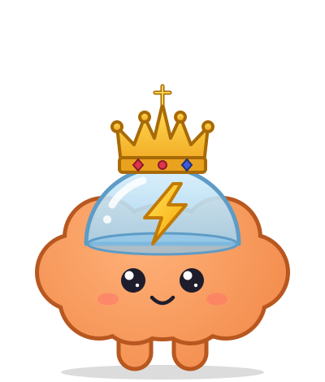
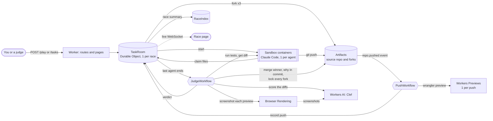

<p align="center">
  
</p>

# Thunderdome

Agents compete on each task. A judge picks the best change. The winner ships, and the
"why" stays with the commit.

You give one task. Thunderdome forks the repo once per agent, and 3 Claude Code agents (Dillion,
Sam and Leo) race at the same time, each in its own container on its own fork. They claim
files before they edit, so clashes show up before they become merge conflicts. Every push
builds a live preview. When the last agent ends, a judge runs each fork's tests, scores the
diffs with Workers AI, merges the winner into the source repo, and writes why it won into
the merge commit. There is no pull request: the race replaces it.

Built on Cloudflare: Artifacts (git repos with a Workers binding, plus push events), Sandbox
containers, Durable Objects, Workflows, Workers Previews, Workers AI (Clef), Browser Rendering
and Workers static assets. See [PLAN.md](PLAN.md) for the build plan and [docs/api-notes.md](docs/api-notes.md)
for the platform APIs we use.

## How it works



1. **Fork.** A race forks the source repo once per agent with the Artifacts binding, and each
   fork gets its own write token. A demo template is first forked into a fresh source repo, so
   the template never changes.
2. **Race.** Each agent runs Claude Code in its own Sandbox container, with its own style
   (careful, fast, tester). Before editing, it claims files on the TaskRoom's claim board; a
   file another agent holds becomes a shared claim (a clash), which costs claim points when another
   agent did the task without that file. Agents
   push to their fork as they work. Tokens stay outside the sandbox: the outbound proxy adds them.
3. **Push events.** Each push fires an Artifacts `repo.pushed` event into the `thunderdome-push`
   Workflow. It records the push on the TaskRoom (the git graph) and builds a Workers Preview
   of that commit.
4. **Judge.** When the last agent ends, the `thunderdome-judge` Workflow clones each fork, runs its
   tests, and scores its diff for task fit and clarity with Clef on Workers AI. The score is
   tests 50, task fit 25, clarity 15 and claims 10. When the task asks for a visible change, the
   judge also screenshots each fork's preview with Browser Rendering and Clef scores how the page
   looks; then the score is tests 45, task fit 20, clarity 10, look 15 and claims 10. It writes a
   "why" that names what decided the race.
5. **Ship.** The winner's fork is merged into the source repo with the why as the merge commit
   body, and every fork is locked and kept as a record. There is no pull request: the race replaces it.

The TaskRoom sends every change to the race page on a WebSocket. The RaceIndex keeps the race
list for the gallery and leaderboard, and PlayQuota guards `/play`.

## Try it

The live deploy is at **https://thunderdome.git-bc1.workers.dev**:

- [`/races`](https://thunderdome.git-bc1.workers.dev/races): every race, a leaderboard, and a replay of each one.
- [`/play`](https://thunderdome.git-bc1.workers.dev/play): start your own race on a demo app (a few races per day).
- `/race/<id>`: one race, live or as a replay (`?replay`). The robots act out each real
  step; below them are the Cloudflare pipeline, the git graph of the forks, the claim board,
  the previews, a before/after view and the judge's scores. Click a robot to see its code.

## Needs

- A Cloudflare account on the **Workers Paid** plan, with Artifacts on. Workers AI and Browser Rendering need no extra setup.
- An Anthropic API key for the agents.
- Node.js 22.18 or later.
- Docker or Podman: wrangler builds the sandbox image on deploy. For Podman, see
  [Using Podman instead of Docker](#using-podman-instead-of-docker).

## Run it yourself

**1. Install and test.**

```sh
npm install
npm run check        # typecheck + unit tests
```

**2. Point it at your account.** In `wrangler.jsonc`, set `CF_ACCOUNT_ID` to your account id
(`npx wrangler whoami` shows it). The Worker is named `thunderdome`.

**3. Log in and set the secrets.**

```sh
npx wrangler login
npx wrangler secret put ADMIN_TOKEN                # any long random string; guards the admin routes
npx wrangler secret put ANTHROPIC_API_KEY          # the agents' model key; it never enters a sandbox
npx wrangler secret put CLOUDFLARE_PREVIEW_TOKEN   # API token with Account → Workers Scripts: Edit; builds previews, never enters a sandbox
```

**4. Deploy.**

```sh
npm run deploy       # builds the page scripts and the sandbox image, then deploys
```

Options, set at deploy with `--var`:

- `AGENT_MODEL:<model id>`: the agents' model (empty means Claude Code's default).
- `PLAY_INVITE:<code>`: require an invite code on `/play` (empty means none).
- `PLAY_DAILY_LIMIT:<n>`: races `/play` may start per UTC day (default 10, at most 2 per IP).

For example: `npm run deploy -- --var PLAY_INVITE:letmein`.

**5. Seed the demo apps (once).** Each call makes a template repo from a folder in
[`demo/`](demo/README.md). A race forks the template into a fresh repo, so templates never change.

```sh
export THUNDERDOME=https://thunderdome.<your-subdomain>.workers.dev
export ADMIN_TOKEN=<the token from step 3>
for app in bugs ui clash; do
  curl -X POST $THUNDERDOME/spike/seed -H "authorization: Bearer $ADMIN_TOKEN" \
    -H "content-type: application/json" -d "{\"repo\":\"thunderdome-$app\",\"app\":\"$app\"}"
done
```

**6. Start a race.** Pick one:

- Open `$THUNDERDOME/play`, pick a demo app, edit the task if you like, and press **Start the race**.
  It opens the race page.
- Or with curl (no token; counts against the daily quota):

  ```sh
  curl -X POST $THUNDERDOME/play -H "content-type: application/json" \
    -d '{"template":"thunderdome-bugs","prompt":"The shop'\''s cart is broken and the tests show it. Fix every failing test."}'
  ```

- Or as admin, with the prompts from [`demo/README.md`](demo/README.md). This script creates the
  race (it prints the task id), follows the live feed until the verdict, and checks the previews.
  It reads `ADMIN_TOKEN` and `THUNDERDOME_URL` from the environment:

  ```sh
  THUNDERDOME_URL=$THUNDERDOME node scripts/race.mjs bugs     # or ui, clash, clash-full
  ```

**7. Watch it.** Open `$THUNDERDOME/race/<id>`. Agents get at most 8 minutes, and most races end
sooner; the judge needs about a minute more. Then the winner's fork is merged into the race's
source repo, and the race is on `$THUNDERDOME/races` with a replay.

If previews fail on a new account, check that a Worker named `thunderdome-sample` (`PREVIEW_WORKER`
in `wrangler.jsonc`) exists; previews are made under it. To make it, deploy it once:

```sh
npx wrangler deploy -c scripts/preview-worker.jsonc
```

If git fails with 401, see the open items in [docs/api-notes.md](docs/api-notes.md).

## Costs

Measured on the live deploy, Oct 5, 8 races of the `clash` demo with 3 agents:

| Part | Cost per race | Notes |
|---|---|---|
| Agents (Anthropic API) | $0.43–0.55 | Reported by Claude Code per agent (`costUsd` on each agent). The `bugs` and `ui` demos cost $0.29–0.46 (PLAN.md, Day 9). |
| Conflict race | about $0.10–0.30 | Only when the winner conflicts with a newer source: 3 short resolver runs. |
| Judge (Workers AI, Clef) | small | 2 short questions per fork, plus 1 question per race and 1 question with 3 screenshots per fork when the task is visual; billed as Workers AI usage. |
| Browser Rendering | small | Only for visual tasks: 1 browser per race for 1 + 2 per fork screenshots, about 30–60 s. |
| Containers, Durable Objects, Workflows, Previews | small | Billed by Cloudflare usage on the Workers Paid plan. One race keeps 3 agent containers busy for about 1 to 2 minutes, plus short-lived containers for preview builds, the judge (one per fork) and the merge. |
| Artifacts | — | Not billed before Oct 15, 2026, when Artifacts billing starts. |

The plan itself is Workers Paid. Each race's agents ran for 53–83 s, and the judge and merge
took 13–29 s more. `/play` caps public races at `PLAY_DAILY_LIMIT` per day (default 10), so the
public demo costs at most about $5.50 a day in agent spend.

## Limits

| What | Limit | Where |
|---|---|---|
| Agents per race | 3 to 5 (`/play` always uses 3) | `src/room/task.ts` |
| Agent run time | 8 minutes each; what it pushed by then still counts | `src/agents/runner.ts` |
| Prompt | 10,000 characters (`/play`: 10 to 600) | `src/room/task.ts`, `src/play/play.ts` |
| Public races (`/play`) | 10 per UTC day, 2 per IP | `PLAY_DAILY_LIMIT`, `src/play/play.ts` |
| Demo apps on `/play` | `thunderdome-bugs`, `thunderdome-ui`, `thunderdome-clash` | `src/play/play.ts` |
| Judge test run | 240 s per try, 3 tries; 15 minutes per fork step | `src/judge/judge.ts` |
| Look | waits up to 3 minutes for final previews; 30 s per page load; 8 minutes in all, then judged without look | `src/judge/look.ts`, `src/judge/JudgeWorkflow.ts` |
| Conflict race | 3 resolvers, 5 minutes each, tests 180 s; 20 minutes for the whole ship step | `src/ship/resolve.ts`, `src/judge/JudgeWorkflow.ts` |
| Diff the scorer reads | first 100,000 characters | `src/judge/scorer.ts` |
| Diff saved for the page | 200,000 characters, cut at a whole line | `src/judge/diffs.ts` |
| Push log per agent | newest 50 pushes | `src/room/task.ts` |
| Race list | index keeps 200 races; `GET /tasks` returns 50; prompts cut to 280 characters | `src/room/races.ts` |
| Workers Previews | 500 per Worker (oldest deleted first), 100 deployments per preview | Cloudflare limit |
| Sandbox idle | a container stops after 30 minutes without use | `src/sandbox/ThunderdomeSandbox.ts` |

What it does not do yet:

- The look score sees screenshots, not behavior: a sort control that shows but does not sort
  scores as well as one that works (the tests cover behavior). Look is judged only on the page at
  `/` at two widths, and Clef's look scores for nearly identical pages differ by tenths of a level.
- A task with one obvious answer makes the agents write the same fix. In both `bugs` races on Oct 5
  all three diffs were the same code (one differed only in the order of an import). The judge
  fingerprints each diff's changed lines and says so ("wrote the same fix; careful finished first"),
  but nothing in the code can pick a winner then. `clash-full` asks for more than its tests check,
  so its fixes differ; it is the race to watch.
- Clef's task fit and clarity scores for different but similar fixes are often within a point, so
  many races are decided by a close margin: then the smaller diff wins, then the agent that finished
  first. A clash costs claim points only when it was avoidable, so claim order alone no longer picks
  the winner (it decided all 4 races on the live deploy on Oct 5; replayed under this rule, 1 was
  decided by code, 2 were close and 1 was the same fix).
- A conflict race ships only a resolution whose tests all pass. When none does, or a resolver
  runs out of time, the ship stays `"conflict"` and nothing is merged. Resolvers see the conflict
  and the task, not the other race that changed the source.
- Agents run on Anthropic's API, so `ANTHROPIC_API_KEY` must have credits.

## Reference

### Create a task by hand

The Day 1 check seeds the `thunderdome-sample` repo (once), forks it, clones the fork in a sandbox,
pushes a commit, and reads the commit back through the binding:

```sh
curl -X POST $THUNDERDOME/spike/day1 -H "authorization: Bearer $ADMIN_TOKEN"
```

Pass: the JSON has `"ok": true`.

Then make a task. It forks the repo (or a template, with `"template"` in place of `"repo"`) once
per agent (3 to 5, default 3) and returns one write token per fork. Only this response shows the tokens.

```sh
curl -X POST $THUNDERDOME/tasks \
  -H "authorization: Bearer $ADMIN_TOKEN" \
  -H "content-type: application/json" \
  -d '{"template":"thunderdome-bugs","prompt":"Fix every failing test","agents":3}'

curl $THUNDERDOME/tasks/<id>
```

Pass: the first call returns `201` with `"status": "ready"` and 3 agents, each with a
`fork`, `remote` and `token`. The second call returns the same task without tokens.

### Run the race

Start the agents of a `ready` task. Each agent runs Claude Code in its own sandbox, with its
own style (`careful`, `fast`, `tester`, `lean`, `tidy`), for at most 8 minutes. Agents commit
and push to their fork after each working step. When an agent ends, the sandbox commits what
is left, pushes the fork, and reports `DONE` to the TaskRoom.

The runner also commits and pushes each agent's work after each test run and after edits (at
most every 20 s), so previews change during the race.

```sh
curl -X POST https://thunderdome.<your-subdomain>.workers.dev/tasks/<id>/run \
  -H "authorization: Bearer $ADMIN_TOKEN"

# Follow the agents. Pass the last "next" value as "after" to get only new steps.
curl "https://thunderdome.<your-subdomain>.workers.dev/tasks/<id>/steps?after=0" \
  -H "authorization: Bearer $ADMIN_TOKEN"
```

Pass: after at most about 9 minutes, `GET /tasks/<id>` shows `"status": "finished"` and each
agent has `"pushed": true` and a `commit`.

### Watch a race live

Open `https://thunderdome.<your-subdomain>.workers.dev/race/<id>` in a browser. No token is needed:
the page and the read routes it uses (`GET /tasks/<id>`, `/steps`, `/claims`, `/judge`, the fork
diffs and the `/live` WebSocket) are public. Creating, running and judging a task still need
`ADMIN_TOKEN`. Fork tokens never reach task state or the step log (the sandbox proxy adds them),
so nothing secret is public.

Each agent is a robot in its own color: Dillion (careful, orange), Sam (fast, red),
Leo (tester, blue), and lean (green) and tidy (purple) in bigger races. Every move is a real event:

| The robot | When the agent |
|---|---|
| scans (eyes glow) | reads or searches code |
| swings a hammer | edits a file |
| charges up | runs the tests |
| thinks (speech bubble) | writes text; the bubble shows its newest step |
| plants a flag | claims files |
| lunges at another robot, with sparks | claims a file another agent holds (a clash) |
| fires a bolt at the core | pushes to its fork; the counter shows its commits |
| falls over | fails or runs out of time |
| jumps with a crown / slumps | wins / loses the verdict |

Below the stage: the claim grid (clashes in red), the base "before" preview next to each agent's
newest preview, and at the end the scoreboard and the judge's why.

For a raw feed, any WebSocket client works:

```sh
npx wscat -c wss://thunderdome.<your-subdomain>.workers.dev/tasks/<id>/live
```

Open it before or after `POST /tasks/<id>/run`. The first message is a `snapshot` with the
current task. Then every change comes as one JSON message with a `kind` and the `taskId`:

| `kind` | When |
|---|---|
| `status` | The run starts, and again once the sandboxes started (`task` is the full task) |
| `steps` | An agent took steps (`agent`, `steps` with `seq`, the same as `/steps`) |
| `claim`, `release` | An agent claimed or released files (`result` / `released`) |
| `push` | A push to an agent's fork was recorded (`push`: `commits`, `pushes`, `head`, `headMessage`, `lastPushAt`, `log`) |
| `preview` | A preview of the agent's newest push is live (`preview`: `url`, `commit`, `at`) |
| `base-preview` | The base preview of the source is live (`preview`: `url`, `commit`, `at`) |
| `agent-end` | An agent ended (`outcome`, and the task `status`) |
| `verdict` | The judge saved its verdict |

A request without `Upgrade: websocket` gets `426`. The server ignores messages you send.

### Race gallery

Every race is listed in one race index (the `RaceIndex` Durable Object). A TaskRoom records its
race when it is created, when it starts, when it finishes, and when the verdict is saved. The
index keeps the newest 200 races, with each prompt cut to 280 characters so the list fits in
one storage value.

- `GET /tasks` is public. It returns `{ races }`, newest first, at most 50. Each race has its
  `id`, `prompt` (cut to 280 characters), `status`, times, `agents`, `winner` once judged, and
  `clash` (two agents claimed the same file). Once judged it also has `scores` (`agent` and
  `total` per fork, in ranked order) and `decidedBy` (`"code"`, `"claims"` or `"close"`) for the
  leaderboard. Races judged before these fields have neither, and `decidedBy` is missing when
  there was no winner or no eligible runner-up.
- `https://thunderdome.<your-subdomain>.workers.dev/races` is the gallery page (`public/races.html`).
  No auth. It lists `GET /tasks` and links each race to its live page, or to its replay
  (`/race/<id>?replay`) once judged.
- `POST /admin/races` with `{ ids }` (1 to 50 task ids) adds races made before the index. It
  needs `ADMIN_TOKEN` and returns `{ recorded, missing }`; `missing` lists ids with no task.

```sh
curl https://thunderdome.<your-subdomain>.workers.dev/tasks

curl -X POST https://thunderdome.<your-subdomain>.workers.dev/admin/races \
  -H "authorization: Bearer $ADMIN_TOKEN" -H "content-type: application/json" \
  -d '{"ids":["t-0123abcd","t-4567cdef"]}'
```

### Live previews

Every push to a fork's `main` builds a Workers Preview of exactly that commit. The previews
show up on the task:

```sh
curl https://thunderdome.<your-subdomain>.workers.dev/tasks/<id> \
  -H "authorization: Bearer $ADMIN_TOKEN"
```

Each agent has a `push` once its fork got a push: `push.preview.url` is the newest preview and
`push.preview.commit` the commit it was built from. `push.head` is the newest pushed commit,
`push.commits` and `push.pushes` count what was pushed, and `push.lastPushAt` says when. A
preview is saved only for the newest head, so while a build runs, `push.preview.commit` can lag
behind `push.head`. The `thunderdome-push` Workflow instances show build failures.

`push.log` lists the recorded pushes for the git graph, oldest first, at most the newest 50: each
entry has `at` (when it was recorded), `commit`, `commits` (the commits it counted), and `message`
when the push had one. A push repeated by an event retry is recorded once. Tasks from before the
log have no `push.log`; read it as empty.

Each race also gets a base preview of the source repo at the commit the forks were made from,
built when the race starts: `basePreview` (`url`, `commit`, `at`) in `GET /tasks/<id>` and a
`base-preview` message on the live socket. It is the "before" picture next to the agents' previews.

### Judge and ship

You do not call anything else. When the last agent ends, the TaskRoom starts the judge. The
judge scores each fork, rating its diff for task fit and clarity with Cloudflare's Clef
(`@cf/cloudflare/clef`) on Workers AI through the `AI` binding (so no extra API key is needed),
picks a winner, and merges the winner's fork into the source repo's
default branch.

**Look.** Clef first answers a yes/no question on the task text: does it ask for a change a person
would see on the page? If yes, the judge waits until each fork's preview is built from the fork's
final commit (up to 3 minutes), then uses the `BROWSER` binding to screenshot the "before" page and
each fork's page at desktop (1280 px) and phone (390 px) width. Clef sees those screenshots and
scores two things on 5 levels: how completely the page shows what the task asks (60%) and how
clean and readable it is (40%). A fork whose preview is missing or does not load gets 0 look
points, and the why says so. If the screenshots or Clef fail for every fork, or the look runs past
its 8-minute budget, the race is judged without look rather than give the forks left 0. The merge commit holds the "why". Then it makes every fork read-only and saves
the verdict on the task.

If the source moved on during the race (another race shipped first, or someone pushed), the
winner's merge can conflict. Then the ship starts a **conflict race**: a second sandbox clones
the source, adds one `git worktree` per resolver (careful, fast, tester), starts the same merge in
each, and runs Claude Code in all of them at once. Each resolution is checked (no conflict markers left, and
a real merge of the source head and the winner), then tested and committed. The one that finished
first with all its tests passing is pushed as the merge commit, with a line under the why on who resolved it.
The other committed resolutions are kept on the source as `thunderdome/<task>/resolve-<resolver>`
branches. The resolvers' sandbox has read tokens only; the chosen merge comes back to the ship sandbox,
which holds the write token, as a git bundle.

Read the verdict on the task once it is saved:

```sh
curl https://thunderdome.<your-subdomain>.workers.dev/tasks/<id> \
  -H "authorization: Bearer $ADMIN_TOKEN"
```

Pass: the task has a `verdict` with `winner`, `why`, `judgedAt` and `ship`. When
`ship.status` is `"merged"`, `ship.commit` is the merge commit on the source repo. Its message is
`Thunderdome: ship <winner>'s fork for task <id>`, then the why. `ship.locks` has one entry per
fork, with `revoked` (the write tokens it revoked) or `error`. Other `ship.status` values:
`"conflict"` (the merge did not apply and no resolver passed every test; `ship.output` has git's
output), `"no-winner"`, and
`"error"` (`ship.error` says why). The verdict also has `scores` (per fork, in ranked order:
`agent`, `total`, `eligible`, and `parts` with `tests`, `taskFit`, `clarity`, `look` (only when the race was judged on look) and `claim`) and
`decidedBy` (`"code"`, `"claims"`, `"close"`, or `"same"` when the winner and the runner-up wrote the
same fix; missing with no winner or no eligible runner-up).
After a conflict, `ship.resolve` has `files` (what conflicted), `attempts` (per resolver: `status`
`"green"`, `"red"`, `"unresolved"` or `"failed"`, `seconds`, `tests`, `commit`, `costUsd`, `note`),
`chosen`, `kept` (the branches that keep the other attempts) and `error` when the race itself failed.

To stage a conflict on the live deploy, `node --env-file=.env scripts/conflict.mjs` runs two races
at once on one source repo; the one that ships second conflicts (about $1).

To follow the judge while it runs, or to see each fork's scores:

```sh
curl https://thunderdome.<your-subdomain>.workers.dev/tasks/<id>/judge \
  -H "authorization: Bearer $ADMIN_TOKEN"
```

Its `output`, once `"status": "complete"`, has the scores, the why and the same `ship` result.

If the judge did not start (`GET /tasks/<id>/judge` returns `404` on a finished task), start
it by hand. It returns `202`, or `409` with the instance status if a judge already exists:

```sh
curl -X POST https://thunderdome.<your-subdomain>.workers.dev/tasks/<id>/judge \
  -H "authorization: Bearer $ADMIN_TOKEN"
```

### Fork diffs

The judge saves the diff it scored for each fork (from the fork's starting point to its head),
cut to whole lines within 200,000 characters. Saving is best effort: a failed save is logged
(`judge.diff_save_failed`) and the judge goes on.

`GET /tasks/<id>/forks/<agent>/diff` is public. `<agent>` is the agent's name (lowercase letters).
It returns `{ agent, diff, clipped }`, where `clipped` is true when the diff was cut, or `404`
`{ "error": "not found" }` before the judge saved one. Other methods get `405`.

```sh
curl https://thunderdome.<your-subdomain>.workers.dev/tasks/<id>/forks/careful/diff
```

### Run your own race

Anyone can start a 3-agent race on a demo template, without `ADMIN_TOKEN`. A daily quota (the
`PlayQuota` Durable Object, one instance `"daily"`) guards it: at most `PLAY_DAILY_LIMIT` races
per UTC day, and at most 2 per IP.

- `https://thunderdome.<your-subdomain>.workers.dev/play` is the play form page (`public/play.html`). No auth.
- `POST /play` with `{ template, prompt, invite? }`. `template` is one of `thunderdome-bugs`, `thunderdome-ui`
  or `thunderdome-clash`, and `prompt` is 10 to 600 characters (trimmed). `invite` is needed only when
  `PLAY_INVITE` is set. It creates the task, starts it, and returns `202`
  `{ id, page: "/race/<id>", remaining }`. It never returns fork tokens. Errors: `400` for a bad
  body, `403` `{ "error": "invite code is wrong" }`, and `429` `{ error, reason }` when the quota is
  used up (`reason` is `"daily"` or `"ip"`). A failed create or run returns its own status and error,
  and the play still counts.
- `GET /play/quota` returns `{ day, used, limit, remaining, invite }`. `invite` is true when an
  invite code is set.

Two vars in `wrangler.jsonc` set it up:

- `PLAY_DAILY_LIMIT`: races per UTC day, default `"10"`. Anything that is not a positive integer means 10.
- `PLAY_INVITE`: the invite code. Empty (the default) means no invite code. Set it at deploy with
  `npm run deploy -- --var PLAY_INVITE:<code>`.

```sh
curl -X POST https://thunderdome.<your-subdomain>.workers.dev/play \
  -H "content-type: application/json" \
  -d '{"template":"thunderdome-bugs","prompt":"Fix the failing tests"}'

curl https://thunderdome.<your-subdomain>.workers.dev/play/quota
```

### Claim board

Agents claim files before they edit them. In the sandbox they run `claim <file>...`,
`claim --shared <file>...`, `claim --release [<file>...]`, or `claim --list`. A claim is never
refused, because each agent works in its own fork: a claim on a file another agent holds becomes a
shared claim, and the response lists the clash. The judge takes 2 of the 10 claim points from a fork
that changed a file it held only as shared, but only when another fork that passed tests did the task
without changing that file. A clash every fork needed costs nothing. You can use the board by hand too:

```sh
curl -X POST https://thunderdome.<your-subdomain>.workers.dev/tasks/<id>/claims \
  -H "authorization: Bearer $ADMIN_TOKEN" -H "content-type: application/json" \
  -d '{"agent":"careful","files":["src/text.ts"]}'

curl https://thunderdome.<your-subdomain>.workers.dev/tasks/<id>/claims \
  -H "authorization: Bearer $ADMIN_TOKEN"
```

### Using Podman instead of Docker

Point wrangler at Podman and its socket before `npm run deploy`. The wrapper script drops
two Docker-only build flags that wrangler sends (`--provenance=false`, `--load`), and saves
the Dockerfile that wrangler pipes on stdin to a temp file (Podman cannot read it from a socket).

```sh
# macOS
podman machine start
export WRANGLER_DOCKER_BIN="$PWD/scripts/podman-as-docker.sh"
export DOCKER_HOST="unix://$(podman machine inspect --format '{{.ConnectionInfo.PodmanSocket.Path}}')"

# Linux
systemctl --user start podman.socket
export WRANGLER_DOCKER_BIN="$PWD/scripts/podman-as-docker.sh"
export DOCKER_HOST="unix://$XDG_RUNTIME_DIR/podman/podman.sock"
```

If git fails with 401, see open item 1 in [docs/api-notes.md](docs/api-notes.md).

## Layout

| Path | What |
|---|---|
| `src/index.ts` | Worker routes |
| `src/spike.ts` | Day 1 check: seed → fork → push → read back |
| `src/routes/tasks.ts` | `/tasks` routes, including the judge routes, the fork diffs, the live WebSocket and the race backfill |
| `src/routes/play.ts` | `POST /play` and `GET /play/quota`: the public run-your-own-race routes |
| `src/room/TaskRoom.ts` | Durable Object, 1 per task: task state, fork tokens, saved fork diffs, live WebSockets, and the judge's auto start |
| `src/room/task.ts` | Task input checks, fork setup, and state changes (no Durable Object code, unit tested) |
| `src/room/races.ts` | Race summaries and the newest-first race list rules (unit tested) |
| `src/room/RaceIndex.ts` | Durable Object, 1 instance ("all"): the race list for `GET /tasks` and the gallery |
| `src/play/play.ts` | Play input checks and the daily quota rules (unit tested) |
| `src/play/PlayQuota.ts` | Durable Object, 1 instance ("daily"): the public `/play` quota |
| `src/agents/prompt.ts` | Agent names, styles, and the rules every agent follows |
| `src/agents/runner.ts` | The Claude Code command line and the time limit |
| `src/agents/events.ts` | Turns Claude Code output into steps for the log |
| `src/room/claims.ts` | Claim board rules (unit tested) |
| `src/judge/JudgeWorkflow.ts` | Workflow: judge each fork, save its diff, judge the look, decide, ship, save the verdict |
| `src/judge/look.ts` | The look: is the task visual, which previews are final, and Clef's score of each fork's screenshots (unit tested) |
| `src/judge/diffs.ts` | Clips a fork diff before it is saved (unit tested) |
| `src/ship/ship.ts` | Merges the winner into the source repo and locks every fork (unit tested) |
| `src/ship/resolve.ts` | The conflict race: resolvers in git worktrees, checked and tested; the first green resolution ships (unit tested) |
| `src/push/push.ts` | Reads fork push events; preview name, config and URL (unit tested) |
| `src/push/PushWorkflow.ts` | Workflow per push: record it in the TaskRoom, build the preview, save its URL |
| `src/sandbox/thunderdomeApi.ts` | The Thunderdome API agents call from the sandbox (claims) |
| `image/claim.mjs` | The `claim` CLI in the sandbox image |
| `image/autopush.mjs` | The hook that commits and pushes agents' work as they go |
| `src/artifacts/repo.ts` | Wrapper on the Artifacts binding |
| `src/sandbox/ThunderdomeSandbox.ts` | Durable Object that owns one container per agent |
| `src/sandbox/policy.ts`, `outbound.ts` | Sandbox network rules; adds the git and preview tokens outside the sandbox |
| `demo/sample-app/` | The first sample app (Day 1 check). 2 tests fail on purpose. |
| `scripts/build-sample.mjs` | Packs the sample app into the Worker for seeding |
| `src/routes/access.ts` | Which routes are public and which need `ADMIN_TOKEN` (unit tested) |
| `src/ui/board.ts` | The race page's state: live events in, robots, claim grid and scores out (unit tested) |
| `src/ui/timeline.ts`, `platform.ts` | Replay timeline and the Cloudflare pipeline strip (unit tested) |
| `src/ui/gitgraph.ts`, `graphview.ts` | The git graph of the forks: model (unit tested) and SVG |
| `src/ui/diffview.ts`, `diffdialog.ts` | A robot's code: diff parser (unit tested) and dialog |
| `src/ui/leaderboard.ts` | Standings and stats across races (unit tested) |
| `src/ui/app.ts`, `src/ui/sprites.ts` | The race page script and its pixel robot art |
| `src/ui/races.ts`, `src/ui/playpage.ts` | The gallery and leaderboard page, and the run-your-own-race page |
| `public/*.html`, `public/race.css` | The pages, served as static assets |
| `scripts/build-ui.mjs` | Bundles the page scripts into `public/race.js`, `races.js` and `play.js` |
| `scripts/race.mjs` | Runs one demo race from the command line and prints what happened |
| `scripts/conflict.mjs` | Runs two races on one source repo so the second ship starts a conflict race |
| `demo/` | The demo apps (`bugs`, `ui`, `clash`) and their prompts |

## License

[MIT](LICENSE)
